# Healt Insurance Cross Sell Prediction

## Problem
Company that provide health insurance for their customers want to expand their services by providing vehicle insurance for their customers. This company want to see the tendency of customers who have been given health insurance to be interested in vehicle insurance services

## Goals
Build a model to predict the potential customers that will be interested in vehicle insurance. This can help the company to be able to develop a communication strategy with customers who might be interested

## About Data

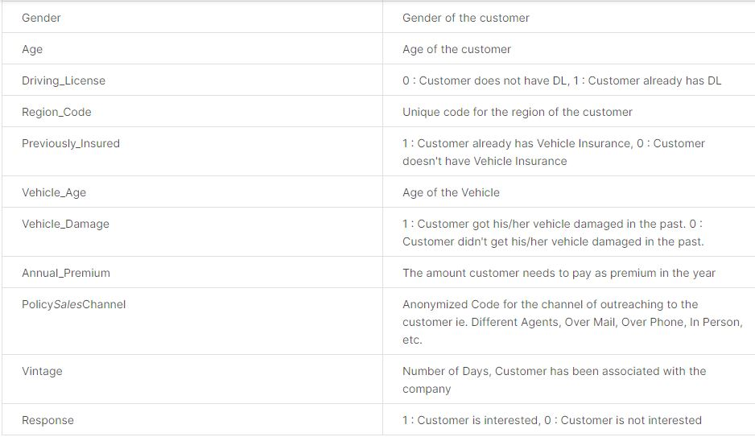

## Exploratory Data Analysis
- Customers are in the age range of 20 - 85 years
- There are customers who have a driving license and some are not
- Premium payments for health insurance range from 2630 - 540165
- The length of time the customer uses insurance services at the company is in the range of 10 days - 299 days

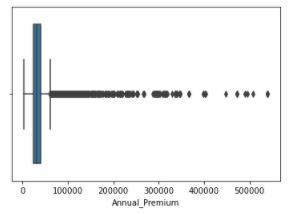

- There are many outliers on the premium that must be paid annually. This can happen because each customer uses insurance with a different category / service

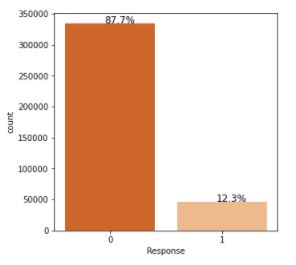

- A total of ~ 88% responded not interested (Data imbalanced)

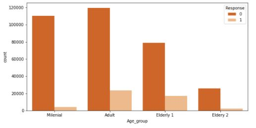

- Adult and Eldery 1 is the most age group who response yes

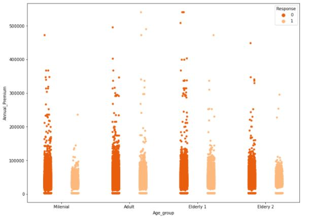

- Adult and Eldery 1 have more customers who pay with a higher premium who response yes. This company doesn't need to worry because pretty much of high premium customers are interested in buying insurance which this brings profit to the company

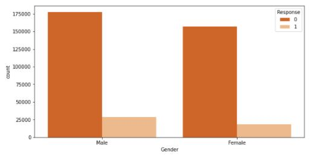

- This company have more dominant male customer who response yes

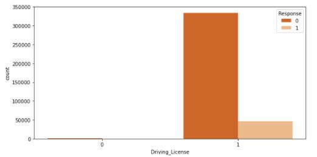

- Customers who already have a driving license tend to be interested in vehicle insurance services

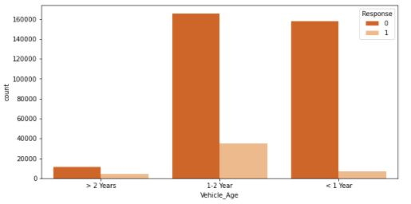

- Customers who have a vehicle age of 1 - 2 years tend to be interested in vehicle insurance services

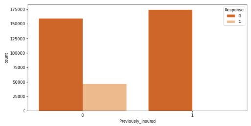

- Customers who don't have vehicle insurance before are more potential to response yes

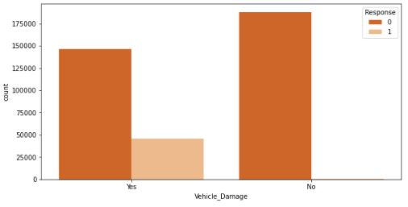

- Customers who have previously experienced damage to their vehicles tend to receive vehicle insurance services

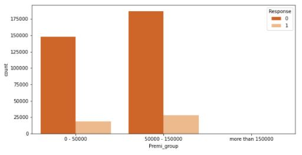

- Customers who have premi range between 50.000 - 150.000 in healt insurance tend to be interested in vehicle insurance services

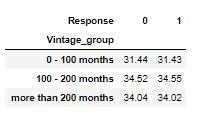

- Customers who associated with a company in 100 - 200 months are more potential to response yes

